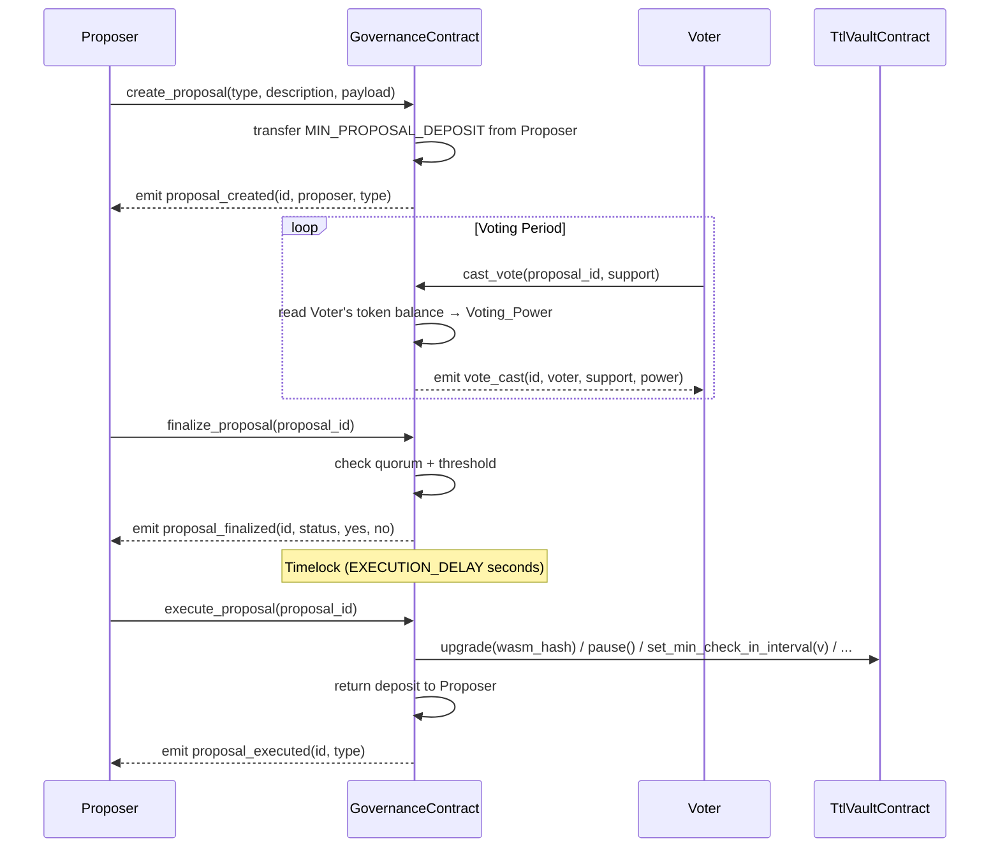

# Design Document: DAO Governance for Protocol Upgrades

## Overview

This feature introduces a new `GovernanceContract` Soroban smart contract that replaces the single-admin upgrade authority in `TtlVaultContract` with a decentralized on-chain governance system. Token holders create proposals, vote using their governance token balance as voting power, and approved proposals are executed on-chain after a mandatory timelock.

The `TtlVaultContract` is minimally modified to accept the `GovernanceContract` address as an authorized caller for upgrade and configuration operations, while retaining the existing admin for emergency operations (pause/unpause) and backwards compatibility when no governance contract is set.



## Architecture

### Contract Separation

```
┌─────────────────────────────────────────────────────────┐
│                  GovernanceContract                      │
│  - Proposal lifecycle (create, vote, finalize, execute)  │
│  - Deposit management (MIN_PROPOSAL_DEPOSIT escrow)      │
│  - Config storage (voting period, quorum, threshold)     │
│  - Cross-contract calls to TtlVaultContract              │
└──────────────────────────┬──────────────────────────────┘
                           │ authorized cross-contract call
┌──────────────────────────▼──────────────────────────────┐
│                  TtlVaultContract (modified)             │
│  - Accepts GovernanceContract address as authorized      │
│    caller for: upgrade, set_min_check_in_interval,       │
│    set_max_check_in_interval, pause, unpause             │
│  - Admin retained for emergency pause/unpause only       │
│  - Falls back to admin-only if governance not set        │
└─────────────────────────────────────────────────────────┘
```

### Key Design Decisions

1. **Separate contract**: Governance logic lives in a new `GovernanceContract` rather than extending `TtlVaultContract`. This keeps the vault contract's audit surface minimal and allows governance to be upgraded independently.

2. **Read-only voting power**: Governance tokens are never locked or transferred from voters. Voting power is the voter's token balance at the moment `cast_vote` is called. This avoids complex lock/unlock mechanics and is consistent with how many on-chain governance systems work (e.g. Compound Governor Bravo snapshot-free variant).

3. **Deposit escrow**: The proposer's `MIN_PROPOSAL_DEPOSIT` is held by the governance contract and returned on execution or cancellation. This discourages spam proposals without requiring a separate staking mechanism.

4. **Integer basis-point arithmetic**: All threshold and quorum comparisons use integer arithmetic in basis points (1 bps = 0.01%). The yes-vote ratio is computed as `(yes_votes * 10_000) / (yes_votes + no_votes)` with no rounding in favor of passage, matching the requirement.

5. **Timelock**: A mandatory `EXECUTION_DELAY` between a proposal passing and becoming executable gives the community time to react to unexpected outcomes (e.g. cancel a malicious passed proposal via DAO_Admin).

6. **Backwards compatibility**: If `GovernanceContract` address is not set in `TtlVaultContract`, all operations fall back to requiring the existing admin. This preserves the current behavior for deployments that have not yet adopted governance.

## Components and Interfaces

### GovernanceContract Entry Points

```rust
pub trait GovernanceContractTrait {
    // Initialization
    fn initialize(
        env: Env,
        governance_token: Address,
        dao_admin: Address,
        config: GovernanceConfig,
    );

    // Proposal lifecycle
    fn create_proposal(
        env: Env,
        proposer: Address,
        proposal_type: ProposalType,
        description: String,
        payload: ProposalPayload,
    ) -> u64;

    fn cast_vote(env: Env, voter: Address, proposal_id: u64, support: bool);

    fn finalize_proposal(env: Env, proposal_id: u64);

    fn execute_proposal(env: Env, proposal_id: u64);

    fn cancel_proposal(env: Env, caller: Address, proposal_id: u64);

    // Queries (no auth required)
    fn get_proposal(env: Env, proposal_id: u64) -> Proposal;
    fn get_vote(env: Env, proposal_id: u64, voter: Address) -> VoteRecord;
    fn get_proposal_count(env: Env) -> u64;
    fn has_voted(env: Env, proposal_id: u64, voter: Address) -> bool;
    fn get_config(env: Env) -> GovernanceConfig;
}
```

### TtlVaultContract Changes

Two new `DataKey` variants and a modified authorization helper:

```rust
// New DataKey variants in types.rs
GovernanceContract,   // Option<Address> — the authorized governance contract

// Modified require_admin helper (pseudo-code)
fn require_admin_or_governance(env: &Env) {
    let admin: Address = load_admin(env);
    if let Some(gov) = load_governance_contract(env) {
        // Accept call from either admin or governance contract
        // The caller must have already authorized via require_auth on their side
        // We check env.invoker() or use require_auth on both
        gov.require_auth_or(admin.require_auth())
    } else {
        admin.require_auth();
    }
}

// upgrade() is restricted to governance-only once governance is set
fn upgrade(env: Env, new_wasm_hash: BytesN<32>) {
    if let Some(gov) = load_governance_contract(&env) {
        gov.require_auth();  // only governance can upgrade
    } else {
        require_admin(&env); // fallback
    }
    env.deployer().update_current_contract_wasm(new_wasm_hash);
}
```

New entry point on `TtlVaultContract`:

```rust
// Sets the governance contract address (admin only, one-time or updatable)
pub fn set_governance_contract(env: Env, governance_contract: Address);
pub fn get_governance_contract(env: Env) -> Option<Address>;
```

## Data Models

### `GovernanceConfig`

```rust
#[contracttype]
#[derive(Clone)]
pub struct GovernanceConfig {
    /// Duration of the voting window in seconds.
    pub voting_period: u64,
    /// Minimum total voting power (yes + no) required for a proposal to be eligible for execution.
    pub quorum: i128,
    /// Minimum yes-vote ratio in basis points (5001–10000) required for passage.
    pub approval_threshold: u32,
    /// Mandatory wait in seconds between a proposal passing and becoming executable.
    pub execution_delay: u64,
    /// Governance tokens the proposer must deposit to create a proposal.
    pub min_proposal_deposit: i128,
}
```

### `ProposalType` and `ProposalPayload`

```rust
#[contracttype]
#[derive(Clone)]
pub enum ProposalType {
    UpgradeContract,
    SetMinCheckInInterval,
    SetMaxCheckInInterval,
    PauseContract,
    UnpauseContract,
    UpdateGovernanceConfig,
}

#[contracttype]
#[derive(Clone)]
pub enum ProposalPayload {
    /// WASM hash for UpgradeContract proposals.
    WasmHash(BytesN<32>),
    /// Interval value in seconds for SetMinCheckInInterval / SetMaxCheckInInterval.
    Interval(u64),
    /// New governance configuration for UpdateGovernanceConfig proposals.
    Config(GovernanceConfig),
    /// No payload required (PauseContract, UnpauseContract).
    None,
}
```

### `Proposal`

```rust
#[contracttype]
#[derive(Clone)]
pub struct Proposal {
    pub id: u64,
    pub proposer: Address,
    pub proposal_type: ProposalType,
    pub description: String,
    pub payload: ProposalPayload,
    pub status: ProposalStatus,
    pub yes_votes: i128,
    pub no_votes: i128,
    /// Ledger timestamp when the proposal was created.
    pub start_time: u64,
    /// Ledger timestamp after which no more votes are accepted (start_time + VOTING_PERIOD).
    pub voting_end_time: u64,
    /// Ledger timestamp after which the proposal may be executed (set when status → Passed).
    /// Zero when not yet passed.
    pub executable_at: u64,
}

#[contracttype]
#[derive(Clone, PartialEq)]
pub enum ProposalStatus {
    Active,
    Passed,
    Failed,
    Executed,
    Cancelled,
}
```

### `VoteRecord`

```rust
#[contracttype]
#[derive(Clone)]
pub struct VoteRecord {
    pub support: bool,
    pub voting_power: i128,
}
```

### `GovernanceError`

```rust
#[contracterror]
#[derive(Copy, Clone, Debug, Eq, PartialEq)]
#[repr(u32)]
pub enum GovernanceError {
    AlreadyInitialized = 1,
    NotInitialized = 2,
    InsufficientVotingPower = 3,
    InsufficientDeposit = 4,
    DescriptionTooLong = 5,
    ContractPaused = 6,
    ProposalNotFound = 7,
    ProposalNotActive = 8,
    VotingPeriodEnded = 9,
    AlreadyVoted = 10,
    VotingPeriodNotEnded = 11,
    TimelockNotExpired = 12,
    ProposalNotPassed = 13,
    ProposalNotCancellable = 14,
    Unauthorized = 15,
    InvalidConfig = 16,
    VoteNotFound = 17,
    InvalidPayload = 18,
}
```

### Storage Keys

```rust
#[contracttype]
#[derive(Clone)]
pub enum GovDataKey {
    /// Instance: GovernanceConfig
    Config,
    /// Instance: Address (governance token)
    GovernanceToken,
    /// Instance: Address (DAO admin)
    DaoAdmin,
    /// Instance: Address (TtlVaultContract)
    VaultContract,
    /// Persistent: u64 (total proposals created)
    ProposalCount,
    /// Persistent: Proposal (keyed by proposal_id)
    Proposal(u64),
    /// Persistent: VoteRecord (keyed by proposal_id + voter)
    Vote(u64, Address),
}
```

### Constants

```rust
pub const MAX_DESCRIPTION_LEN: u32 = 512;

/// Minimum TTL threshold before extending persistent entries (in ledgers).
pub const GOV_TTL_THRESHOLD: u32 = 1_000;

/// Default persistent TTL for proposal/vote records (in ledgers).
/// Sized to cover VOTING_PERIOD + EXECUTION_DELAY + 30 days at 5s/ledger.
/// 30 days = 518_400 ledgers; add generous buffer → 1_000_000 ledgers ≈ 57 days.
pub const GOV_PROPOSAL_TTL: u32 = 1_000_000;

/// Instance storage TTL (same as TtlVaultContract).
pub const GOV_INSTANCE_TTL: u32 = 200_000;
pub const GOV_INSTANCE_TTL_THRESHOLD: u32 = 1_000;
```

## Correctness Properties

*A property is a characteristic or behavior that should hold true across all valid executions of a system — essentially, a formal statement about what the system should do. Properties serve as the bridge between human-readable specifications and machine-verifiable correctness guarantees.*

### Property 1: Voting Power Equals Token Balance at Vote Time

*For any* voter with a non-zero governance token balance, when they cast a vote on an active proposal, the `voting_power` recorded in their `VoteRecord` must equal their governance token balance at the moment `cast_vote` was called.

**Validates: Requirements 1.2**

### Property 2: Voter Token Balance Unchanged After Voting

*For any* voter, their governance token balance immediately before and immediately after calling `cast_vote` must be identical — the contract must not transfer or lock tokens from voters.

**Validates: Requirements 1.4**

### Property 3: Proposal Deposit Transferred on Creation

*For any* proposer with a balance ≥ `MIN_PROPOSAL_DEPOSIT`, after a successful `create_proposal` call, the proposer's governance token balance must have decreased by exactly `MIN_PROPOSAL_DEPOSIT` and the governance contract's balance must have increased by the same amount.

**Validates: Requirements 1.5**

### Property 4: Proposal Creation Invariants

*For any* valid `create_proposal` call (valid type, description within length, sufficient deposit, contract not paused), the resulting `Proposal` must have `status = Active` and `voting_end_time = start_time + VOTING_PERIOD`.

**Validates: Requirements 2.1, 2.8**

### Property 5: Proposal IDs Are Monotonically Increasing

*For any* sequence of N successful `create_proposal` calls, the assigned `Proposal_Id` values must form the sequence 1, 2, …, N in order, and `get_proposal_count` must return N after all N proposals are created.

**Validates: Requirements 2.2, 8.5**

### Property 6: Vote Tally Accumulates Correctly

*For any* active proposal and any set of voters with distinct addresses, after each voter casts a vote, the proposal's `yes_votes` (or `no_votes`) must equal the sum of the `voting_power` values of all voters who voted yes (or no).

**Validates: Requirements 3.1**

### Property 7: Double-Vote Prevention

*For any* voter who has already cast a vote on a given proposal, a second call to `cast_vote` on the same proposal must return `GovernanceError::AlreadyVoted` and must not modify the proposal's vote tallies.

**Validates: Requirements 3.4**

### Property 8: Finalization to Passed When Quorum and Threshold Met

*For any* proposal whose voting period has ended and whose `(yes_votes + no_votes) >= QUORUM` and `(yes_votes * 10_000) / (yes_votes + no_votes) >= APPROVAL_THRESHOLD`, calling `finalize_proposal` must set the proposal status to `Passed` and set `executable_at = current_time + EXECUTION_DELAY`.

**Validates: Requirements 4.1**

### Property 9: Finalization to Failed When Criteria Not Met, Deposit Returned

*For any* proposal whose voting period has ended and whose vote totals do not satisfy both quorum and threshold, calling `finalize_proposal` must set the proposal status to `Failed` and return `MIN_PROPOSAL_DEPOSIT` to the proposer.

**Validates: Requirements 4.2**

### Property 10: Yes Vote Ratio Formula Correctness

*For any* non-zero total vote count `(yes + no)`, the computed approval ratio must equal `(yes * 10_000) / (yes + no)` using integer division with no rounding in favor of passage (i.e., truncating division).

**Validates: Requirements 4.6**

### Property 11: Execution Invariants

*For any* proposal with `status = Passed` and `current_time >= executable_at`, calling `execute_proposal` must: set the proposal status to `Executed`, return `MIN_PROPOSAL_DEPOSIT` to the proposer, and emit a `proposal_executed` event containing the `Proposal_Id` and `ProposalType`.

**Validates: Requirements 5.1, 5.8**

### Property 12: Cancellation Invariants

*For any* proposal that is cancellable (Active for proposer; Active or Passed for DAO_Admin), calling `cancel_proposal` by an authorized caller must: set the proposal status to `Cancelled`, return `MIN_PROPOSAL_DEPOSIT` to the proposer, and emit a `proposal_cancelled` event containing the `Proposal_Id` and the cancelling address.

**Validates: Requirements 6.1, 6.2, 6.5**

### Property 13: Config Round-Trip

*For any* valid `GovernanceConfig` written at initialization or via an executed `UpdateGovernanceConfig` proposal, calling `get_config` must return a config with identical field values.

**Validates: Requirements 7.1, 7.3**

### Property 14: Proposal Record Round-Trip

*For any* valid `Proposal` written via `create_proposal` or mutated via `finalize_proposal` / `execute_proposal` / `cancel_proposal`, calling `get_proposal` with the same `Proposal_Id` must return a record with identical field values.

**Validates: Requirements 8.1, 11.2**

### Property 15: Vote Record Round-Trip

*For any* valid `VoteRecord` written via `cast_vote`, calling `get_vote` with the same `(Proposal_Id, Voter)` pair must return a record with identical `support` and `voting_power` values.

**Validates: Requirements 8.3, 11.3**

### Property 16: Admin Cannot Upgrade When Governance Is Set

*For any* `TtlVaultContract` instance where a `GovernanceContract` address has been set, a direct call to `upgrade` from the admin address must be rejected (not authorized), while the same call from the governance contract address must succeed.

**Validates: Requirements 9.4**

## Error Handling

| Error | Trigger | Recovery |
|---|---|---|
| `InsufficientVotingPower` | `cast_vote` with zero token balance | Acquire governance tokens |
| `InsufficientDeposit` | `create_proposal` with balance < `MIN_PROPOSAL_DEPOSIT` | Acquire more governance tokens |
| `DescriptionTooLong` | Description > 512 bytes | Shorten description |
| `ContractPaused` | `create_proposal` while paused | Wait for unpause |
| `ProposalNotFound` | Query with non-existent `Proposal_Id` | Use valid ID from `get_proposal_count` |
| `ProposalNotActive` | `cast_vote` or `finalize_proposal` on non-Active proposal | Check proposal status first |
| `VotingPeriodEnded` | `cast_vote` after `voting_end_time` | Voting window has closed |
| `VotingPeriodNotEnded` | `finalize_proposal` before `voting_end_time` | Wait for voting period to end |
| `AlreadyVoted` | `cast_vote` by a voter who already voted | Each address may vote once per proposal |
| `TimelockNotExpired` | `execute_proposal` before `executable_at` | Wait for timelock to expire |
| `ProposalNotPassed` | `execute_proposal` on non-Passed proposal | Proposal must be in Passed status |
| `ProposalNotCancellable` | `cancel_proposal` on Executed/Failed/Cancelled | Terminal status; cannot cancel |
| `Unauthorized` | `cancel_proposal` by non-proposer, non-admin | Only proposer or DAO_Admin may cancel |
| `InvalidConfig` | `APPROVAL_THRESHOLD` outside 5001–10000 or `VOTING_PERIOD` = 0 | Provide valid config values |
| `InvalidPayload` | Missing required payload for proposal type | Include required payload (WASM hash, interval, config) |
| `VoteNotFound` | `get_vote` for non-existent `(Proposal_Id, Voter)` | Voter has not voted on this proposal |

Cross-contract call failures (e.g. `TtlVaultContract` rejecting an upgrade) are propagated as-is. The `GovernanceContract` does not swallow errors from the vault contract; the proposal remains in `Passed` status and can be retried after the underlying issue is resolved.

## Testing Strategy

### Dual Testing Approach

Both unit tests and property-based tests are required. Unit tests cover specific examples, integration points, and error conditions. Property-based tests verify universal invariants across randomly generated inputs.

### Unit Tests

Focus areas:
- Full proposal lifecycle: create → vote → finalize → execute for each `ProposalType`
- Deposit escrow: deposit held on creation, returned on execution, returned on failure, returned on cancellation
- Authorization: admin-only operations, proposer-only cancellation, governance-only upgrade
- Config validation: boundary values for `APPROVAL_THRESHOLD` (5001, 10000, 5000, 10001) and `VOTING_PERIOD` (0, 1)
- Backwards compatibility: vault with no governance contract set still accepts admin calls
- Error paths: each `GovernanceError` variant triggered by a specific invalid input

### Property-Based Tests

Use the [`proptest`](https://github.com/proptest-rs/proptest) crate (Rust). Each property test must run a minimum of **100 iterations**.

Each test must include a comment referencing the design property it validates:
```
// Feature: dao-governance-protocol-upgrades, Property N: <property_text>
```

**Property 1 — Voting power equals token balance at vote time**
Generate: random voter address, random non-zero token balance, active proposal.
Assert: `vote_record.voting_power == token_balance_at_vote_time`.

**Property 2 — Voter token balance unchanged after voting**
Generate: random voter, random balance, active proposal.
Assert: `balance_before == balance_after` for the voter's token account.

**Property 3 — Proposal deposit transferred on creation**
Generate: random proposer with balance ≥ `MIN_PROPOSAL_DEPOSIT`, random valid proposal.
Assert: `proposer_balance_after == proposer_balance_before - MIN_PROPOSAL_DEPOSIT`.

**Property 4 — Proposal creation invariants**
Generate: random valid proposal inputs (type, description ≤ 512 bytes, sufficient deposit).
Assert: `proposal.status == Active` and `proposal.voting_end_time == proposal.start_time + VOTING_PERIOD`.

**Property 5 — Proposal IDs are monotonically increasing**
Generate: random count N (1–50) of valid proposals.
Assert: IDs are 1..N in order; `get_proposal_count() == N`.

**Property 6 — Vote tally accumulates correctly**
Generate: random set of voters with distinct addresses and random non-zero balances, random support values.
Assert: `proposal.yes_votes == sum(power for voters who voted yes)` and `proposal.no_votes == sum(power for voters who voted no)`.

**Property 7 — Double-vote prevention**
Generate: random voter, active proposal.
Assert: second `cast_vote` returns `AlreadyVoted`; tallies unchanged.

**Property 8 — Finalization to Passed when quorum and threshold met**
Generate: random proposals with vote distributions satisfying quorum and threshold.
Assert: `proposal.status == Passed` and `proposal.executable_at == finalize_time + EXECUTION_DELAY`.

**Property 9 — Finalization to Failed when criteria not met, deposit returned**
Generate: random proposals with vote distributions that fail quorum or threshold.
Assert: `proposal.status == Failed`; proposer balance restored by `MIN_PROPOSAL_DEPOSIT`.

**Property 10 — Yes vote ratio formula correctness**
Generate: random `yes_votes` and `no_votes` (both > 0).
Assert: computed ratio equals `(yes_votes * 10_000) / (yes_votes + no_votes)` (integer division).

**Property 11 — Execution invariants**
Generate: random passed proposals past their timelock.
Assert: after `execute_proposal`, `proposal.status == Executed`; proposer balance increased by `MIN_PROPOSAL_DEPOSIT`; `proposal_executed` event emitted.

**Property 12 — Cancellation invariants**
Generate: random cancellable proposals, random authorized canceller (proposer or DAO_Admin).
Assert: `proposal.status == Cancelled`; proposer balance restored; `proposal_cancelled` event emitted.

**Property 13 — Config round-trip**
Generate: random valid `GovernanceConfig` (threshold in 5001–10000, period > 0).
Assert: `get_config()` returns identical field values after initialization or `UpdateGovernanceConfig` execution.

**Property 14 — Proposal record round-trip**
Generate: random valid proposals at various lifecycle stages.
Assert: `get_proposal(id)` returns a record with identical field values to what was written.

**Property 15 — Vote record round-trip**
Generate: random voters, random support values, random non-zero balances.
Assert: `get_vote(proposal_id, voter)` returns identical `support` and `voting_power`.

**Property 16 — Admin cannot upgrade when governance is set**
Generate: random vault state with governance contract set.
Assert: `upgrade` called by admin returns an authorization error; same call from governance contract address succeeds.
