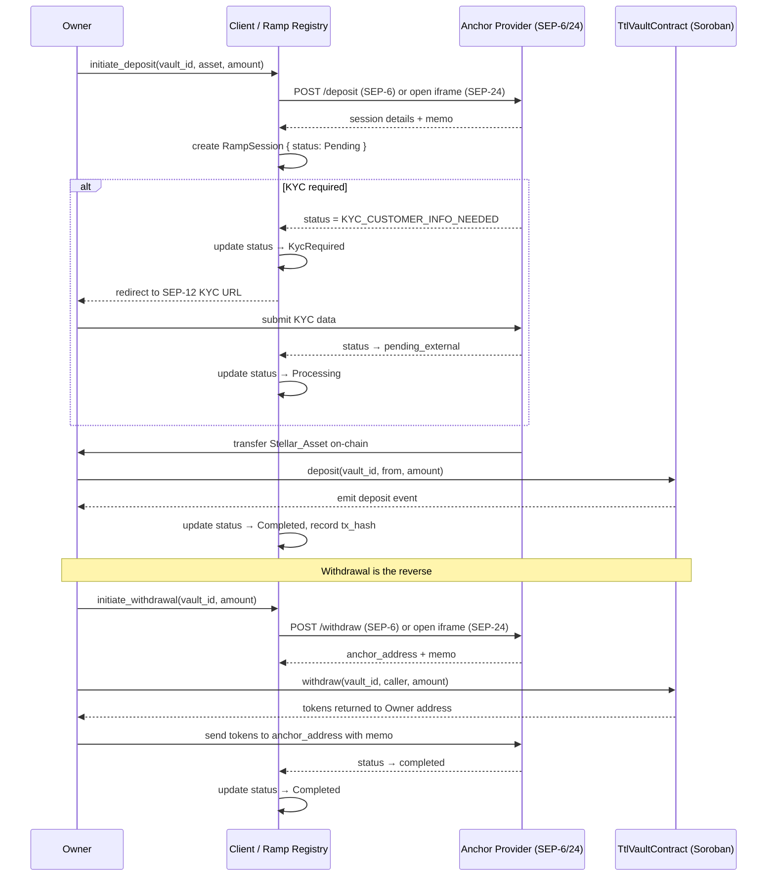

# Design Document: Fiat On/Off-Ramps

## Overview

This feature adds fiat on/off-ramp capability to the TTL-Legacy vault system by integrating with Stellar's anchor ecosystem via SEP-6, SEP-24, and SEP-31 protocols. The design is deliberately split across two layers:

- **On-chain (TtlVaultContract)**: No changes required. The existing `whitelist_token`, `deposit`, and `withdraw` entry points already handle whitelisted Stellar-native stablecoins (e.g. USDC, EURC). The contract is the settlement layer and immutable audit trail.
- **Off-chain (Ramp Registry / Client)**: A client-side module that manages `Ramp_Session` records, communicates with anchor REST APIs, drives the SEP-6/24/31 flows, handles KYC redirects, polls for status, and persists session state to local storage.

The vault contract itself remains token-agnostic and SEP-unaware. Fiat conversion is entirely the anchor's responsibility. The client bridges the two worlds by initiating anchor flows and then calling the existing contract entry points once tokens are in play.



## Architecture

### Layer Separation

```
┌─────────────────────────────────────────────────────────┐
│                     Client Application                   │
│  ┌──────────────────────────────────────────────────┐   │
│  │               Ramp Registry                       │   │
│  │  - RampSession CRUD                               │   │
│  │  - Anchor provider config store                   │   │
│  │  - Status polling loop (5–60 s intervals)         │   │
│  │  - Serialization / persistence (JSON)             │   │
│  │  - Dispute management                             │   │
│  └──────────────┬───────────────────────────────────┘   │
│                 │ HTTP (SEP-6/24/31/12)                  │
│  ┌──────────────▼───────────────────────────────────┐   │
│  │           Anchor HTTP Client                      │   │
│  │  - SEP-1 TOML fetcher / validator                 │   │
│  │  - SEP-6 /deposit, /withdraw, /transaction        │   │
│  │  - SEP-24 interactive URL launcher                │   │
│  │  - SEP-31 /send                                   │   │
│  │  - Retry with exponential backoff (3 attempts)    │   │
│  └──────────────────────────────────────────────────┘   │
└─────────────────────────────────────────────────────────┘
                          │ Stellar SDK
┌─────────────────────────▼───────────────────────────────┐
│              TtlVaultContract (Soroban)                  │
│  whitelist_token · deposit · withdraw · events           │
└─────────────────────────────────────────────────────────┘
```

### Key Design Decisions

1. **No on-chain changes**: The vault contract is not modified. All SEP protocol logic lives off-chain. This avoids adding external HTTP dependencies to a Soroban contract (which cannot make outbound calls) and keeps the contract audit surface minimal.

2. **Ramp Registry is client-side**: Session state is persisted to client-side storage (e.g. `localStorage` in a browser, a local SQLite/JSON file in a CLI). This avoids a centralized backend requirement while still providing an audit trail.

3. **Memo = session_id (truncated)**: For SEP-6 flows, the Stellar transaction memo is set to the `session_id` truncated to `MAX_MEMO_LEN` (28) bytes. This links the on-chain transfer to the off-chain session record.

4. **Polling, not webhooks**: The client polls anchor status endpoints at 5–60 second intervals. Webhooks are not universally supported across SEP implementations.

5. **KYC reuse**: Where the anchor supports it, the client passes a previously verified `customer_id` to skip redundant KYC submissions.

## Components and Interfaces

### Ramp Registry

The Ramp Registry is the central off-chain module. It exposes the following interface (TypeScript-style pseudocode for clarity; actual implementation language follows the client stack):

```typescript
interface RampRegistry {
  // Provider management
  addProvider(sepTomlUrl: string): Promise<AnchorProvider>;
  getProvider(providerId: string): AnchorProvider;
  listProviders(): AnchorProvider[];

  // Session lifecycle
  initiateDeposit(params: DepositParams): Promise<RampSession>;
  initiateWithdrawal(params: WithdrawalParams): Promise<RampSession>;
  getSession(sessionId: string): RampSession;
  listSessions(filter?: SessionFilter): RampSession[];

  // Status management
  pollSession(sessionId: string): Promise<RampSession>;
  markCompleted(sessionId: string, txHash: string, externalRef: string): RampSession;
  markFailed(sessionId: string, reason: string): RampSession;
  raiseDispute(sessionId: string, description: string): RampSession;
  resolveDispute(sessionId: string, resolution: 'completed' | 'failed', note: string): RampSession;

  // Persistence
  serialize(session: RampSession): string;       // → JSON
  deserialize(json: string): RampSession;
}
```

### Anchor HTTP Client

Wraps the SEP REST APIs with retry logic:

```typescript
interface AnchorHttpClient {
  fetchToml(domain: string): Promise<StellarToml>;
  sep6Deposit(params: Sep6DepositParams): Promise<Sep6DepositResponse>;
  sep6Withdraw(params: Sep6WithdrawParams): Promise<Sep6WithdrawResponse>;
  sep6TransactionStatus(anchorUrl: string, txId: string, jwt: string): Promise<AnchorTxStatus>;
  sep24InteractiveUrl(params: Sep24Params): Promise<string>;
  sep24TransactionStatus(anchorUrl: string, txId: string, jwt: string): Promise<AnchorTxStatus>;
  sep31Send(params: Sep31SendParams): Promise<Sep31SendResponse>;
}
```

Retry policy: up to 3 attempts with exponential backoff (1 s, 2 s, 4 s) on network timeouts or 5xx responses.

### TtlVaultContract (unchanged)

The relevant existing entry points used by the ramp flow:

```rust
// Whitelist a Stellar_Asset issued by an anchor (admin only)
pub fn whitelist_token(env: Env, token_address: Address)

// Deposit whitelisted tokens into a vault (called after anchor transfers tokens to Owner)
pub fn deposit(env: Env, vault_id: u64, from: Address, amount: i128)

// Withdraw tokens from vault to Owner address (called before sending to anchor)
pub fn withdraw(env: Env, vault_id: u64, caller: Address, amount: i128) -> Result<(), ContractError>
```

No new contract entry points are required for this feature.

## Data Models

### `AnchorProvider`

```typescript
interface AnchorProvider {
  id: string;                    // derived from domain, e.g. "circle.com"
  sepTomlUrl: string;            // https://{domain}/.well-known/stellar.toml
  sepServerUrl: string;          // TRANSFER_SERVER or TRANSFER_SERVER_SEP0024
  supportedSeps: SepProtocol[];  // subset of [6, 24, 31]
  supportedAssets: StellarAsset[]; // asset codes + issuers
  supportedFiatCurrencies: string[]; // e.g. ["USD", "EUR"]
  supportContact: string;        // email or URL for dispute resolution
  addedAt: number;               // Unix timestamp
}

type SepProtocol = 6 | 24 | 31;

interface StellarAsset {
  code: string;    // e.g. "USDC"
  issuer: string;  // Stellar address of issuer
  contractAddress: string; // Soroban token contract address (for whitelist_token)
}
```

### `RampSession`

```typescript
interface RampSession {
  sessionId: string;           // UUID v4, unique per session
  providerId: string;          // references AnchorProvider.id
  vaultId: string;             // vault_id as string (u64)
  direction: RampDirection;
  status: RampStatus;
  asset: StellarAsset;
  fiatCurrency: string;        // e.g. "USD"
  amount: string;              // decimal string, e.g. "100.00"
  memo: string;                // Stellar tx memo (sessionId truncated to 28 bytes)
  anchorTransactionId: string | null;  // anchor's internal tx ID
  stellarTxHash: string | null;        // on-chain Stellar tx hash after settlement
  externalRef: string | null;          // anchor's external reference (e.g. bank ref)
  kycUrl: string | null;               // SEP-12 KYC URL if KYC required
  customerId: string | null;           // reusable SEP-12 customer ID
  errorMessage: string | null;         // anchor error or failure reason
  disputeDescription: string | null;
  disputeRaisedAt: number | null;      // Unix timestamp
  resolutionNote: string | null;
  createdAt: number;           // Unix timestamp
  updatedAt: number;           // Unix timestamp
  completedAt: number | null;  // Unix timestamp when terminal status reached
}

type RampDirection = 'deposit' | 'withdrawal';

type RampStatus =
  | 'pending'
  | 'kyc_required'
  | 'processing'
  | 'completed'
  | 'failed'
  | 'disputed';
```

### Valid Status Transitions

```
pending → kyc_required → processing → completed
pending → processing → completed
pending → failed
kyc_required → failed
processing → failed
completed → disputed → completed
completed → disputed → failed
failed → disputed → completed
failed → disputed → failed
```

### Constants

```typescript
const MAX_MEMO_LEN = 28;          // Stellar text memo byte limit
const POLL_MIN_INTERVAL_MS = 5_000;   // 5 seconds
const POLL_MAX_INTERVAL_MS = 60_000;  // 60 seconds
const MAX_RETRY_ATTEMPTS = 3;
const SESSION_RETENTION_DAYS = 90;
```

### Serialization Format

`RampSession` records are serialized to JSON. All fields are present in the serialized form; `null` fields are serialized as JSON `null` (not omitted). Numeric timestamps are serialized as JSON numbers (integers). The `vaultId` field is serialized as a JSON string to avoid 64-bit integer precision loss in JavaScript environments.

